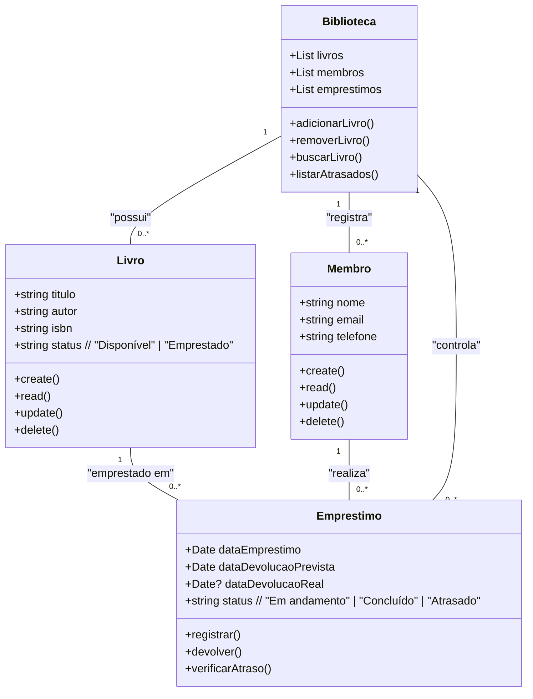
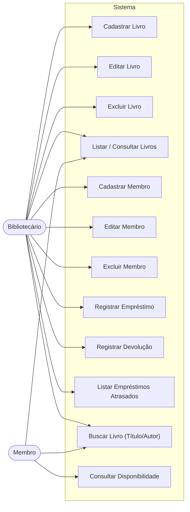
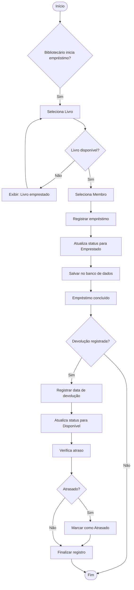

# 📚 Sistema de Gerenciamento de Biblioteca  
### Cliente Fictício: *Biblioteca Comunitária "Ler é Viver"*

---

## 📖 Visão Geral do Projeto
O **Sistema de Gerenciamento de Biblioteca (SGB)** tem como objetivo modernizar a administração do acervo da *Biblioteca Comunitária "Ler é Viver"*, substituindo o uso de fichas de papel por um sistema digital eficiente, seguro e acessível.

Com esta aplicação web, o bibliotecário poderá gerenciar livros, membros e empréstimos de forma automatizada, enquanto os membros da comunidade poderão consultar a disponibilidade dos livros online.

---

## 🎯 Objetivos do Sistema
- Automatizar o registro de **empréstimos e devoluções**.  
- Identificar **livros com devolução atrasada** automaticamente.  
- Permitir **consulta pública** ao acervo, sem necessidade de login.  
- Manter o controle completo de **livros e membros** (CRUD).  
- Exibir **lista de empréstimos atrasados**.  
- *(Diferencial Bônus)*: Implementar **busca de livros por título ou autor**.

---

## 👥 Público-Alvo
- **Bibliotecário (Gestor):**  
  Responsável por cadastrar e gerenciar livros, membros, empréstimos e devoluções.

- **Membro:**  
  Pode consultar o acervo online e verificar se um livro está disponível (sem login).

---

## 🧩 Requisitos Essenciais (MVP)
- **CRUD para Livros:** título, autor, ISBN, status (*Disponível / Emprestado*).  
- **CRUD para Membros:** cadastro, edição, exclusão e listagem.  
- **Registro de Empréstimos:** associar um livro a um membro, com data de empréstimo e devolução prevista.  
- **Registro de Devoluções:** o status do livro retorna para “Disponível”.  
- **Listagem de Empréstimos Atrasados.**  
- **(Bônus)**: Busca de livros por título ou autor.

---

## ⚙️ Tecnologias Utilizadas
- **Frontend:** Next.js 14 (App Router), TypeScript, SCSS  
- **Backend:** API Routes do Next.js, JWT, Bcrypt  
- **Banco de Dados:** MongoDB Atlas + Mongoose (ODM)  
- **Autenticação:** JWT com cookies HTTP-only  
- **Ambiente:** Variáveis de ambiente (.env.local)

---

## 📋 Escopo Detalhado (com Análise de Risco)

### 🔍 **1. Escopo do Sistema**
O sistema abrangerá as seguintes **funcionalidades principais**:

| **Módulo** | **Descrição** |
|-------------|----------------|
| **Gestão de Livros** | Cadastrar, editar, excluir e listar livros do acervo. Permitir busca por título ou autor. |
| **Gestão de Membros** | Cadastro e manutenção de dados dos usuários que realizam empréstimos. |
| **Controle de Empréstimos** | Registro completo de empréstimos, com data prevista e status. |
| **Controle de Devoluções** | Atualiza o status do livro para “Disponível” e verifica se houve atraso. |
| **Listagem de Atrasos** | Exibe uma lista com todos os empréstimos vencidos. |
| **Consulta Pública** | Permite que qualquer visitante consulte o acervo sem login. |

---

### 🚫 **2. Itens Fora do Escopo**
O sistema **não** incluirá neste momento:
- Integração com sistemas de pagamento.  
- Módulo de reservas online.  
- Controle de múltiplos exemplares do mesmo livro.  
- Notificações automáticas por e-mail.  
- Dashboard de estatísticas avançadas.  

Essas funções poderão ser implementadas em futuras versões.

---

### ⚠️ **3. Análise de Riscos**

| **Tipo de Risco** | **Descrição** | **Probabilidade** | **Impacto** | **Plano de Mitigação** |
|--------------------|---------------|-------------------|--------------|-------------------------|
| **Técnico** | Falhas na conexão com o banco de dados (MongoDB Atlas) | Média | Alta | Implementar reconexão automática e tratamento de exceções. |
| **Técnico** | Perda de dados em caso de erro na API | Baixa | Alta | Usar backups regulares e validações no backend. |
| **Segurança** | Vazamento de dados de usuários | Média | Alta | Utilizar criptografia (bcrypt) e JWT seguro (cookies HTTP-only). |
| **Operacional** | Erros de uso por parte do bibliotecário | Alta | Média | Criar interface intuitiva e mensagens de erro claras. |
| **Prazos** | Atraso na entrega do sistema | Média | Média | Dividir o desenvolvimento em sprints semanais com metas curtas. |
| **Escopo** | Solicitação de novas funcionalidades fora do planejado | Alta | Média | Controlar mudanças com documentação e aprovação prévia. |

---

### 🧭 **4. Cronograma (Etapas Principais)**

| **Etapa** | **Duração Estimada** | **Descrição** |
|------------|---------------------|----------------|
| Planejamento e levantamento de requisitos | 1 semana | Entrevistas e análise das necessidades da biblioteca. |
| Modelagem do sistema (UML + Banco) | 1 semana | Criação de diagramas e estrutura inicial de dados. |
| Desenvolvimento do backend (API) | 2 semanas | Implementação das rotas, autenticação e banco. |
| Desenvolvimento do frontend | 2 semanas | Interface visual, formulários e validações. |
| Testes e ajustes finais | 1 semana | Testes funcionais, correção de erros e validação do MVP. |

---

### ✅ **5. Critérios de Sucesso**
O projeto será considerado **bem-sucedido** quando:
- O bibliotecário conseguir registrar e consultar empréstimos sem erros.  
- O status dos livros for atualizado corretamente entre “Disponível” e “Emprestado”.  
- A listagem de atrasados funcionar automaticamente.  
- O sistema for acessível e funcional em qualquer navegador moderno.

---

## 📊 Diagramas UML

---

### 🧱 Diagrama de Classes

---

### Diagrama de Casos de Uso

---

### Diagrama de Fluxo – Empréstimo e Devolução

