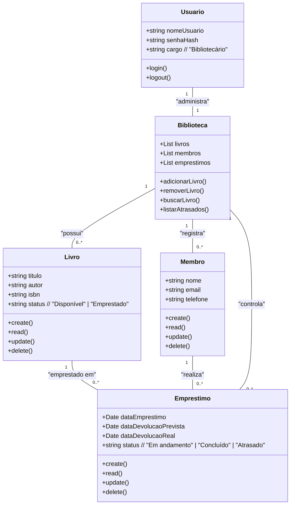

# Sistema de Gestão da Biblioteca Comunitária "Ler é Viver"

## Briefing

### Visão Geral do Projeto
O projeto consiste no desenvolvimento de um **Sistema de Gestão de Biblioteca (SGB)** em formato de aplicação web, com o objetivo de digitalizar o controle de livros, membros e empréstimos, substituindo o uso de fichas de papel por um sistema seguro, eficiente e acessível.

## Escopo

### Objetivos
- Automatizar o registro de empréstimos e devoluções
- Identificar automaticamente livros com devolução atrasada
- Permitir consulta pública ao acervo sem necessidade de login
- Garantir segurança no acesso às funcionalidades administrativas

### Público-Alvo
- **Bibliotecário (Gestor)**: Gerencia livros, membros e empréstimos (CRUD completo)
- **Membros da Comunidade**: Consultam o acervo online para verificar disponibilidade de livros

### Recursos Tecnológicos
- **Frontend**: Next.js 14 (App Router), TypeScript, SCSS
- **Backend**: API Routes do Next.js, JWT, Bcrypt
- **Banco de Dados**: MongoDB Atlas + Mongoose (ODM)
- **Autenticação**: JWT com cookies HTTP-only
- **Ambiente**: Variáveis de ambiente (.env.local)

---

## Diagramas

### Diagrama de Classes



### Diagrama de Casos de Uso

```mermaid
usecaseDiagram
    actor Bibliotecario as B
    actor Membro as M

    rectangle Sistema {
        usecase "Cadastrar Livro" as UC1
        usecase "Editar Livro" as UC2
        usecase "Excluir Livro" as UC3
        usecase "Consultar Livros" as UC4
        usecase "Cadastrar Membro" as UC5
        usecase "Editar Membro" as UC6
        usecase "Excluir Membro" as UC7
        usecase "Registrar Empréstimo" as UC8
        usecase "Registrar Devolução" as UC9
        usecase "Listar Empréstimos Atrasados" as UC10
        usecase "Buscar Livro (título/autor)" as UC11
        usecase "Consultar Disponibilidade de Livro" as UC12
        usecase "Autenticar Login" as UC13
    }

    B --> UC1
    B --> UC2
    B --> UC3
    B --> UC4
    B --> UC5
    B --> UC6
    B --> UC7
    B --> UC8
    B --> UC9
    B --> UC10
    B --> UC11
    B --> UC13

    M --> UC4
    M --> UC11
    M --> UC12
```

### Diagrama de Fluxo (Empréstimo e Devolução)
```mermaid
flowchart TD
    A[Início] --> B{Bibliotecário logado?}
    B -- Não --> Z[Fim]
    B -- Sim --> C[Seleciona Livro no sistema]
    C --> D{Livro está disponível?}
    D -- Não --> E[Exibir mensagem: Livro já emprestado]
    E --> C
    D -- Sim --> F[Seleciona Membro]
    F --> G[Registra dados do Empréstimo]
    G --> H[Atualiza status do livro para "Emprestado"]
    H --> I[Salva no banco de dados]
    I --> J[Empréstimo Concluído]

    J --> K{Devolução realizada?}
    K -- Não --> Z
    K -- Sim --> L[Registrar data da devolução]
    L --> M[Atualiza status do livro para "Disponível"]
    M --> N[Verifica se devolução está atrasada]
    N --> O{Atrasado?}
    O -- Sim --> P[Marcar empréstimo como "Atrasado"]
    O -- Não --> Q[Finalizar registro]
    P --> Q
    Q --> Z[Fim]